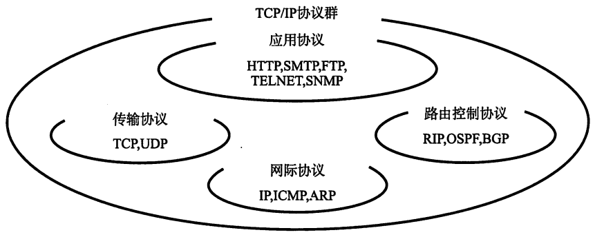
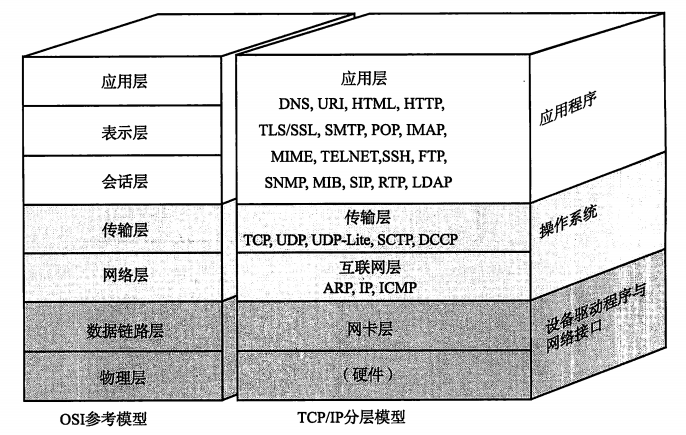

# TCP/IP基础知识

* [什么是TCP/IP？](#anchor1)
* [互联网（The Internet）与TCP/IP的关系](#anchor2)
* [TCP/IP与OSI参考模型](#anchor3)

***

## <a name="anchor1">什么是TCP/IP？

&emsp;&emsp;TCP/IP是对利用IP进行通信时所必须用到的协议群的统称，比如IP或ICMP、TCP或UDP、TELNET或FTP、以及HTTP等。因此，有时也称TCP/IP为**网际协议族**。

## <a name="anchor2">互联网（The Internet）与TCP/IP的关系

​&emsp;&emsp;互联网进行通信时，需要相应的网路协议，TCP/IP原本就是为了使用互联网而开发制定的协议族。因此，互联网的协议就是TCP/IP，TCP/IP就是互联网的协议。

## <a name="anchor3">TCP/IP与OSI参考模型

1. 物理层**PhysicalLayer**:原始比特流的传输(比特bit)
   + 提供传输数据的物理通路  
   + 传输数据 
   + 主要设备:中继器、集线器

2. 数据链路层**DataLinkLayer**:建立相邻节点数据链路传输(帧frame)
   + 数据链路的建立、维护、拆除、指定拓扑结构并提供硬件寻址
   + 数据组帧
   + 控制帧的收发顺序
   + 差错检测与恢复.流量控制
   + 主要设备:二层交换机、网桥

3. 网络层**Network layer** :基于IP地址的路由选路传输数据(数据包packet)
   + 路由选路
   + 拥塞控制、差错检测与恢复
   + 网络互联
   + 主要设备:路由器

4. 传输层**Transport layer:** 常规数据传递,面向连接或者无连接(数据段segment)
   + 流量控制

5. 会话层**Session layer:** 建立会话关系

6. 表示层**Presentation layer**:统一数据传输格式
   + 数据压缩和解压
   + 数据加密和解密

7. 应用层**Application layer** :为用户应用程序提供服务接口

[[Top]](#top)