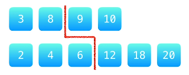
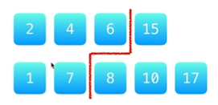
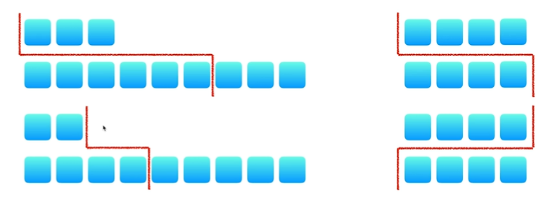

# <a name="top"></a>寻找两个正序数组的中位数

* [问题描述](#anchor1)
* [合并排序法](#anchor2)
* [双指针法](#anchor3)
* [二分法](#anchor4)

***

## <a name="anchor1"></a>问题描述

> 难度：<font color="red">困难</font>  
> 链接：[寻找两个正序数组的中位数](https://leetcode-cn.com/problems/median-of-two-sorted-arrays/)   
> 给定两个大小为 m 和 n 的正序（从小到大）数组<span class="inline_code_block">nums1</span>和<span class="inline_code_block">nums2</span>。
> 请你找出这两个正序数组的中位数，并且要求算法的时间复杂度为 **O(log(m + n))**。
> 你可以假设<span class="inline_code_block">nums1</span>和<span class="inline_code_block">nums2</span>不会同时为空。

[[Top]](#top)

## <a name="anchor2"></a>合并排序法

加入该题没有要求时间复杂度为 **O(log(m + n))**，我们可以采取一下两种时间性能稍高的算法：  

1. 将两个数组合并成一个数组，再用[快速排序](https://www.jianshu.com/p/a68f72278f8f)处理合并后数组，最后直接求中位数。
   * 时间复杂度为**O((m+n)log(m+n))**
   * 空间复杂度为**O(m+n)**
2. 与上面的方法相似，但是合并后不排序，而是通过找第K大数的方法找中位数。具体的题目见[数组中的第K个最大元素](https://leetcode-cn.com/problems/kth-largest-element-in-an-array/)。
   * 时间复杂度为**O(m+n)**
   * 空间复杂度为**O(m+n)**

[[Top]](#top)

## <a name="anchor3"></a>双指针法

每个指针相当于一条分割线，双指针一共将两个数组分层4部分。比如，    
<div align="center"></div>
<div class="img_title">偶数个元素分割结果</div>
<div align="center"></div>
<div class="img_title">偶数个元素分割结果</div>
<div align="center"></div>   
<div class="img_title">特殊分割位置（头部或尾部）</div>

我们使用一条分割线把两个数组分别分割成两部分：   
1. 红线左边和右边的元素个数相等，或者左边元素的个数比右边元素的个数多1个；
2. 红线左边的所有元素的数组<=红线右边的所有元素的数值；  
那么中位数就一定只与红线两侧的元素有关。

<br>
算法思想为：
> 定义两个指针<span class="inline_code_block">nums1Index</span>，<span class="inline_code_block">nums2Index</span>；    
> 定义两个变量<span class="inline_code_block">leftVal</span>，<span class="inline_code_block">rightVal</span>用来表示中位数。如果数组为<span class="inline_code_block">[1,2][3]</span>，中位数就是<span class="inline_code_block">rightVal</span>，如果数组为<span class="inline_code_block">[1,3][2,4]</span>，则<span class="inline_code_block">leftVal=2、rightVal=3</span>     
> 循环$ totalLeft = \frac{nums1.length + nums2.length}{2} + 1 $次，每次比较<span class="inline_code_block">nums1[nums1Index]</span>和<span class="inline_code_block">nums2[nums2Index]</span>，如果小于则<span class="inline_code_block">nums1Index+1</span>否则<span class="inline_code_block">nums2Index+1</span>     
> 同时改变<span class="inline_code_block">leftVal</span>和<span class="inline_code_block">rightVal</span>    
> 最后根据奇偶的情况输入相应值

算法性能如下：
* 时间复杂度为**O(m+n)**
* 空间复杂度为**O(1)**    

算法代码如下：

``` java   
public double findMedianSortedArrays(int[] nums1, int[] nums2) {
	int len1 = nums1.length;
	int len2 = nums2.length;
	/**
	 *  totalLeft表示两个数组合起来后，中位数左边的元素个数
	 *  约定当len1+len2为奇数时，中位数不包括在totalLeft中，
	 *  又因为除法是向下取整的，所以无论奇偶totalLeft=(len1 + len2) / 2
	 */
	int totalLeft = len1 + (len2 - len1) / 2;

	/**
	 * 算法核心部分
	 * leftVal表示中位数的左值，rightVal表示中位数右值。比如在[1,3],[2,4]中，leftVal=2、rightVal=3；
	 * nums1Index表示nums1中的分割指针，nums2Index表示nums2中的分割指针
	 */
	int leftVal = -1, rightVal = -1;
	int nums1Index = 0, nums2Index = 0;
	/**
	 *  由totalLeft定义可知，而且rightVal=nums[index++]
	 *  可以举例[1,3][2,4]这种情况，循环第二次时，leftVal=1、rightVal=2，必须要多循环一次才能得到正确的2，3
	 *  所以应该循环totalLeft+1次
	 */
	for (int i = 0; i <= totalLeft; i++) {
		leftVal = rightVal;
		/* 注意||的用法，因为当nums2的指针指向len2时，指针无法继续移动这个时候只能移动nums1的指针，同理&&的情况也是要移动nums2的指针 */
		if (nums1Index < len1 && (nums2Index >= len2 || nums1[nums1Index] < nums2[nums2Index])) {
			rightVal = nums1[nums1Index++];
		} else {
			rightVal = nums2[nums2Index++];
		}
	}

	if (((len1 & 1) ^ (len2 & 1)) == 0)
		return (leftVal + rightVal) / 2.0;
	else
		return rightVal;
}
```   
在这里和大家分享一道双指针法经典问题[Leetcode88.合并两个有序数组](https://leetcode-cn.com/problems/merge-sorted-array/)希望读者可以自己尝试做一做     
[[Top]](#top) 

## <a name="anchor4"></a>二分法
该方法大体思路和上面的二分法相似，但是划分数组时对单个数组使用了二分法，先确定一个数组中<span class="inline_code_block">left</span>的元素个数，
再用<span class="inline_code_block">left</span>减去<span class="inline_code_block">left</span>得到另一个数组的<span class="inline_code_block">left</span>个数，最后从左半区间找最大值，从右半区找最小值。    
算法中约定$ totalLeft = \frac{nums1.length + nums2.length + 1}{2} $所以当元素总数为偶数时，中位数是<span class="inline_code_block">totalLeft</span>中的最大值。    
因为二分的缘故所以时间复杂度降低到了**O(log(m+n))**。

``` java   
public double findMedianSortedArrays(int[] nums1, int[] nums2) {
	/* 交换数组，确保nums1指向短数组 */
	if (nums1.length > nums2.length) {
		int[] temp = nums1;
		nums1 = nums2;
		nums2 = temp;
	}

	int m = nums1.length;
	int n = nums2.length;

	/* 因为除法是向下取整的，所以无论m+n是奇数还是偶数，中位数都可以用(m+n+1)/2表示 */
	int totalLeft = m + (n - m + 1) / 2;   /* 防止m，n相加大于2^16-1 */

	/**
	 * 算法核心部分
	 * 先确定nums1的分割线位置，nums2的分割线位置可以由totalLeft-i得到
	 * 分割线需要保证nums1[i - 1] <= nums2[j] && nums1[i] >= nums[j - 1]
	 */
	int left = 0;
	int right = m;
	while (left < right) {
		/* +1是为了防止[0,1]这样的数组在二分时进入死循环，需要注意这样写会导致到不了数组的0号位置 */
		int i = left + (right - left + 1) / 2;
		int j = totalLeft - i;
		if (nums1[i - 1] > nums2[j]) {
			right = i - 1;
		} else {
			left = i;
		}
	}

	int i = left;
	int j = totalLeft - left;

	/**
	 * 分别求两个数组分割线左边的最大值和右边的最小值
	 *
	 * 当分割线在下标为0的位置时，令最大值为Integer.MIN_VALUE，因为在求totalLeft的时候需要比较两个数组中左边区间的最大值，
	 * 而0位置的左边没有值，所以要定义整数最小值来确保一定能取另一个数组中分割线左边的值
	 *
	 * 当分割线在下标为数组长度的位置时，令最小值为Integer.MAX_VALUE，因为在求totalRight的时候需要比较两个数组中右边区间的最小值
	 * 数组长度位置是不能取的，为了确保取到另一个数组中分割线右边的值，所以定义为整数最大值
	 */
	int nums1LeftMax = i == 0 ? Integer.MIN_VALUE : nums1[i - 1];
	int nums1RightMin = i == m ? Integer.MAX_VALUE : nums1[i];
	int nums2LeftMax = j == 0 ? Integer.MIN_VALUE : nums2[j - 1];
	int nums2RightMin = j == n ? Integer.MAX_VALUE : nums2[j];

	/**
	 * 按照约定，指针所指的数组下标表示分割线右边第一个数，
	 * 所以当总数为奇数时直接取分割线左边的最大值
	 * 例如nums1=[1],nums2=[2,3]，最终指针分别指向1，1，所以中位数等于Math.max(nums1LeftMax, nums2LeftMax)=2
	 * 当总数为偶数时需要求左边最大值和右边最小值的平均值
	 */
	if ((m % 2 + n % 2) % 2 == 1) {   /* 防止相加溢出 */
		return Math.max(nums1LeftMax, nums2LeftMax);
	} else {
		return (double)(Math.max(nums1LeftMax, nums2LeftMax) + Math.min(nums1RightMin, nums2RightMin)) / 2;
	}
}
```
[[Top]](#top)
