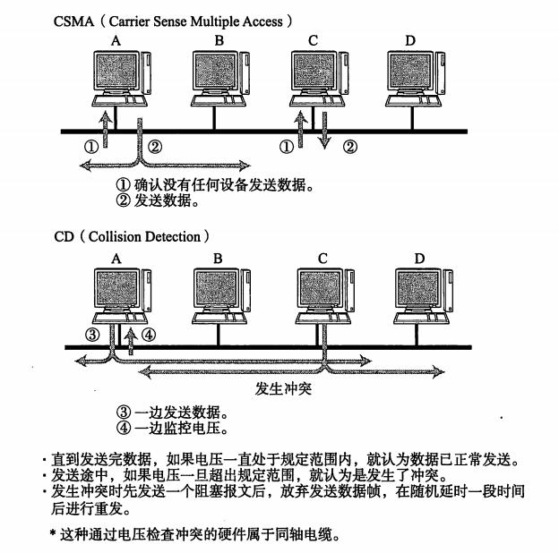
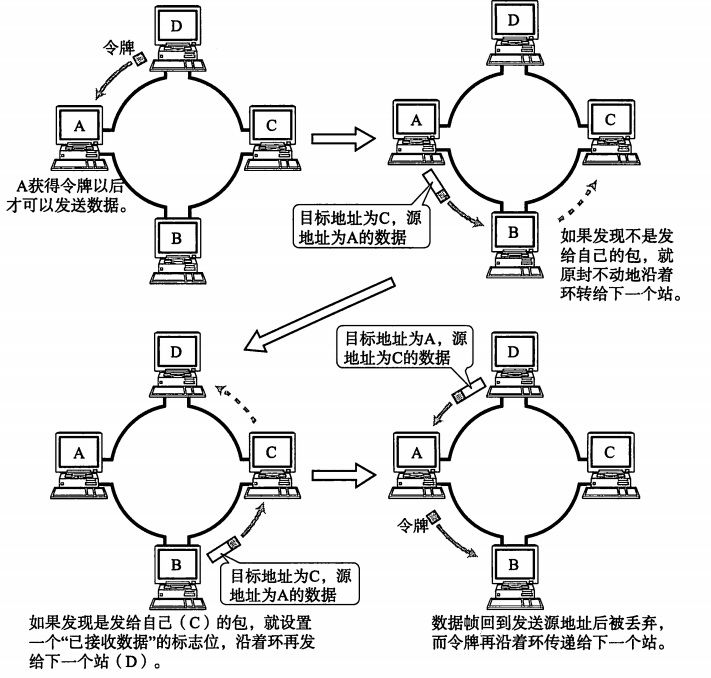
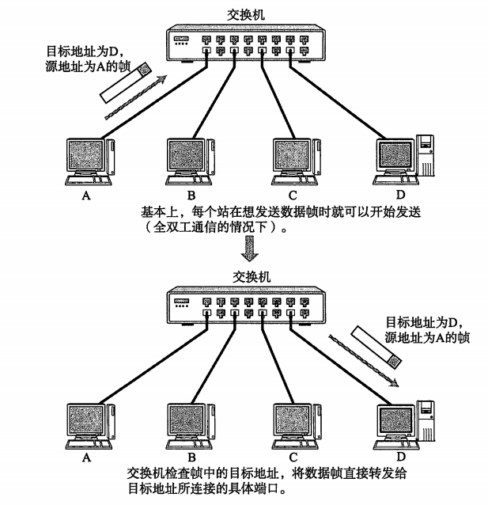

# 数据链路相关技术

* [共享介质型网络](#anchor1)
* [非共享介质网络](#anchor2)
* [广播域、冲突域](#anchor3)

***

## 共享介质型网络

共享介质型网络指由多个设备**共享**一个通信介质的一种网络。在这种方式下，设备之间**使用同一个载波信道进行发送和接受**。
1. 争用方式
   + CSMA（载波监听多路访问）：先到先得的方式占用信道发送数据。
   + CSMA/CD（带碰撞检查的载波监听多路访问）：
      + 如果载波信道上没有数据流动，则任何站都可以发送数据。
	  + 检查是否会发生冲突。一旦发生冲突时，放弃发送数据，同时立即释放载波信道。
	  + 放弃发送以后，随机延时一段时间，再重新争用介质，重新发送帧。

CSMA/CD方式

2. 令牌传递方式（沿着令牌环发送一种叫做“令牌”的特殊报文，只有获得令牌的站才能发送数据）
   + 优点：不会有冲突；每个站都有通过平等循环获得令牌的机会
   + 缺点：网络利用率不高

令牌传递方式

[[Top]](#top)

## 非共享介质型网络

网络中的每个站**直连**交换机，由交换机负责转发数据帧。该方式有个致命弱点，一旦交换机发生故障，与之相连的所有计算机之间都将无法通信。

通过交换机通信

**通信方式**
+ 单工通信（广播）：通信的信道是单向的，发送端与接收端也是固定的，即发送端只能发送信息，不能接收信息；接收端只能接收信息，不能发送信息。基于这种情况，数据信号从一端传送到另外一端，信号流是单方向的。
+ 半双工通信（对讲机）：发送端可以转变为接收端；相应地，接收端也可以转变为发送端。但是在同一个时刻，信息只能在一个方向上传输。因此，也可以将半双工通信理解为一种切换方向的单工通信。
+ 全双工通信（一般型的网络）：允许数据同时在两个方向上传输，又称为双向同时通信，即通信的双方可以同时发送和接收数据。

[[Top]](#top)

## 广播域、冲突域
 
详情见[冲突域和广播域的区分](https://www.cnblogs.com/bakari/archive/2012/09/08/2677086.html)

[[Top]](#top)

