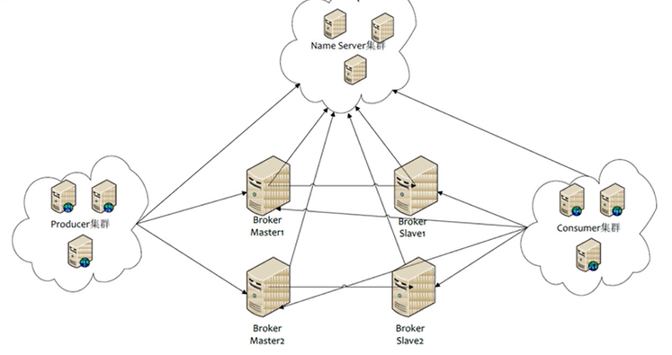
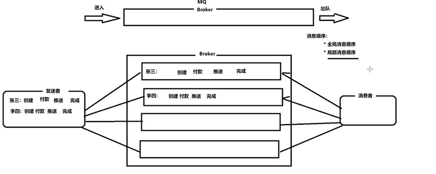
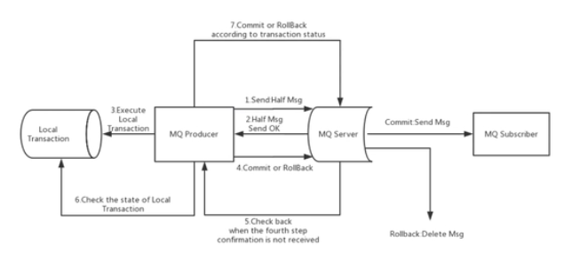

# <a name="top"></a>RocketMQ基础

* [RocketMQ集群](#anchor1)
   1. [角色介绍](#anchor1-1)
   2. [集群模式](#anchor1-2)
* [消息发送](#anchor2)
   1. [发送同步消息](#anchor2-1)
   2. [发送异步消息](#anchor2-2)
   3. [发送单向消息](#anchor2-3)
* [消息接收](#anchor3)
   1. [消费消息一般流程](#anchor3-1)
   2. [广播模式和负载均衡模式](#anchor3-2)
* [顺序消息](#anchor4)
   1. [生产者发送顺序消息](#anchor4-1)
   2. [消费者消费顺序消息](#anchor4-2)
* [延迟消息和批量消息](#anchor5)
   1. [延迟消息](#anchor5-1)
   2. [批量消息](#anchor5-2)
* [事务消息](#anchor6)

***

## <a name="anchor1"></a>RocketMQ集群

<div align="center"></div>   
<div class="img_title">RocketMQ集群</div>   
 
### <a name="anchor1-1"></a>角色介绍

1. Name Server
   + 管理调度中心：管理Broker集群，Producer和Consumer通过与它通信后再与Broker进行消息收发
   + 无状态：每个Broker都会把自己的信息上报给每个Name Server，它们之间不存在信息同步
2. Broker
   + 数据存储中：负责消息的存储（主从模式）
3. Producer
   + 生产者：产生消息然后放入Borker中
4. Consumer
   + 消费者：消费消息
5. Topic
   + 主题：区分消息的种类（一个发送者可以发送消息给一个或多个topic，一个消费者可以订阅一个或多个topic）
6. Message Queue
   + 队列：相当于是topic的分区（用于并行发送和接收消息）

### <a name="anchor1-2"></a>集群模式

1. 单Master模式
2. 多Master模式
**一个集群没有Slave全为Master**
   + 优点：配置简单，具有一定的高可用性
   + 缺点：在宕机的期间，存储在该Broker上的消息会丢失（无持久化）或不可消费（持久化）
3. 多Master多Slave模式（异步）
   + 优点：克服了上一模式中的缺点，同时消息发送的响应速度快
   + 缺点：由于是异步的，所以会出现数据不一致的情况
4. 多Master多Slave模式（同步）
   + 优点：数据一致性好
   + 缺点：响应慢

[[Top]](#top)

## <a name="anchor2"></a>消息发送

### <a name="anchor2-1"></a>发送同步消息
消息发送后会阻塞等待broker响应，因此适合用来发送比较重要的消息
``` java   
public void sendSynMessage() {
	/* 1.定义一个生产者，并指定group */
	DefaultMQProducer producer = new DefaultMQProducer("group1");
	/* 2.指定NameServer地址 */
	producer.setNamesrvAddr("192.168.1.128:9876;192.168.1.129:9876");
	/* 3.启动 */
	producer.start();
	for (int i = 0; i < 3; i++) {
		/* 4.创建消息 */
		Message msg = new Message("base", "tag1", ("helloworld"+i).getBytes());
		/* 5.发送消息 */
		SendResult result = producer.send(msg);
	}
	/* 6.关闭 */
	producer.shutdown();
}
```

### <a name="anchor2-2"></a>发送异步消息

``` java   
public void sendSynMessage() {
	...
	for (int i = 0; i < 3; i++) {
		/* 创建消息 */
		Message msg = new Message("base", "tag1", ("helloworld"+i).getBytes());
		/* 发送异步消息 */
		producer.send(msg, new SendCallback(){
			/* 发送成功回调函数 */
			public void onSuccess(SendResult result) {
				...
			}
			/* 发送失败回调函数 */
			public void onException(Throwable e) {
				...
			}
		});
	}
	...
}
```

### <a name="anchor2-3"></a>发送单向消息

``` java
public void sendOneWayMessage() {
	...
	for (int i = 0; i < 3; i++) {
		/* 创建消息 */
		Message msg = new Message("base", "tag1", ("helloworld"+i).getBytes());
		/* 发送单向消息，sendOneWay返回值为void，只管发 */
		producer.sendOneWay(msg);
	}
	...
}
```

[[Top]](#top)

## <a name="anchor3"></a>消费消息

### <a name="anchor3-1"></a>消费消息一般流程

``` java
public void consumeMessage() {
	/* 1.创建消费者Consumer，制定消费者组名 */
	DefaultMQPushConsumer consumer = new DefaultMQPushConsumer("group1");
	/* 2.指定NameServer地址 */
	consumer.setNamesrvAddr("....");
	/* 3.订阅主题topic和tag */
	consumer.subscribe("base", "tag1");
	/* 4.设置回调函数，处理消息 */
	consumer.registerMessageListener(new MessageListenerConcurrently() {
		/* 处理消息 */
		public ConsumeConcurrentlyStatus consumeMessage(List<MessageExt> msgs, ConsumeConcurrentlyContext context) {
			System.out.println(msgs);
			return ConsumeConcurrentlyStatus.CONSUME_SUCCESS;
		}
	});
	/* 5.启动消费者 */
	consumer.start();
}
```

### <a name="anchor3-2"></a>广播模式和负载均衡模式

+ **广播模式**：订阅的消费者都可以接收到消息。
+ **负载均衡模式（默认）**：所有订阅的消费者以负载均衡的模式消费消息（即所有消费者消费的消息总数等于生产者生产消息的总数）。
> consumer.setMessageModel(Message.BROADCASTING) 广播
> consumer.setMessageModel(Message.CLUSTERING) 负载均衡

[[Top]](#top)

## <a name="anchor4"></a>顺序消息

<div align="center"></div>   
<div class="img_title">顺序消息示意图</div>

> 在发送消息时，要求所有消息都发送到同一队列中，接收消息时，要求一个线程负责消费一个队列，通过这样来保证消息的**局部有序**

### <a name="anchor4-1"></a>生产者发送顺序消息

``` java
public void sendOrderedMessage() {
	DefaultMQProducer producer = new DefaultMQProducer("group1");
	producer.setNamesrvAddr("...");
	producer.start();
	/* 开始发送消息，核心思路正如上面所说的“将消息发送到同意队列中”，具体操作就是根据id来确定消息是否为一组，如果是一组就通过选择器选择同一队列，然后发送 */
	/* 1.获取消息列表 */
	List<Order> orders = ...;
	/* 2.循环列表，对列表里逐条消息进行处理 */
	for (int i = 0; i < orders.size(); i++) {
		Message msg = new Message("OrderTopic", "toyOrder", "i" + i, orders.get(i).getBytes());
		producer.send(msg, new MessageQueueSelector() {
			public MessageQueue select(List<MessageQueue> mqs, Message msg, Object arg) {
				int orderId = (int) arg;
				int index = orderId % mqs.size();
				return mqs.get(index);
			}
		}, orders.get(i).getOrderId());
	}
	/* 3.关闭producer */
	producer.shutdown();
}
```

### <a name="anchor4-2"></a>消费者消费顺序消息

``` java
public void orderedConsumeMessage() {
	DefaultMQPushConsumer consumer = new DefaultMQPushConsumer("group1");
	consumer.setNamesrvAddr("...");
	consumer.subscribe("OrderTopic", "toyOrder");
	/* 设置回调函数消费消息，因为需要一个线程只负责消费一个队列，所以这里选用MessageListenerOrderly */
	consumer.registerMessageListener(new MessageListenerOrderly() {
		public ConsumeOrderlyStatus consumeMessage(List<MessageExt> msgs, ConsumeOrderlyContext context) {
			/* 具体消费逻辑 */
			for...
			return ConsumeOrderlyStatus.SUCCESS;
		}
	});
	consumer.start();
}
```

[[Top]](#top)

## <a name="anchor5"></a>延迟消息和批量消息

### <a name="anchor5-1"></a>延迟消息

该类消息不能**立即被消费者消费**而是要在**过了约定时长后**才能被消费，这个时间可以通过<span class="inline_code_block">message.setDelayTimeLevel(LEVEL)</span>
设置。LEVEL共有**18**级<span class="inline_code_block">1s 5s 10s 30s 1m 2m 3m 4m 5m 6m 7m 8m 9m 10m 20m 30m 1h 2h</span>

``` java
/* 生产者 */
public void produceDelayMessage() {
	...
	Message message = new Message(...);
	message.setDelayTimeLevel(2);
	/* 发送消息 */
}
```

### <a name="anchor5-2"></a>批量消息

如果每次发送的消息大小不超过4MB可以，采用批处理的方式来一次性发送多条消息

``` java
private finale static String TOPIC = "BatchTest";

public void sendMultiMessages() {
	...
	List<Message> messages = new ArrayList<>();
	messages.add(new Message(TOPIC, "tagA", "key1", "hello world1".getBytes()));
	messages.add(new Message(TOPIC, "tagA", "key2", "hello world2".getBytes()));
	messages.add(new Message(TOPIC, "tagA", "key3", "hello world3".getBytes()));
	producer.send(messages);
	...
}
```

> 如果消息大小超过4MB就需要进行消息分割

[[Top]](#top)

## <a name="anchor6"></a>事务消息

<div align="center"></div>   
<div class="img_title">事务消息发送流程</div>

上图说明了事务消息的大致方案，其中分为两个流程：正常事务消息的发送及提交、事务消息的补偿流程。

+ 事务消息发送及提交
   + 发送消息（half消息）
   + 服务端响应消息写入结果
   + 根据发送结果执行本地事务（如果写入失败，此时half消息对业务不可见，本地逻辑不执行）
   + 根据本地事务状态执行Commit或者Rollback（Commint操作生成消息索引，消息对消费者可见）
+ 事务补偿
   + 对没有Commit/Rollback的事务消息（pending状态的消息），从服务端发起一次“回查”
   + Producer收到回查消息，检查回查消息对应的本地事务的状态
   + 根据本地事务状态，重新Commit或者Rollback
其中，补偿阶段用于解决消息Commit或者Rollback发生超时或者失败的情况
+ 事务消息状态（提交状态、回滚状态、中间状态）
   + TransactionStatus.CommitTransaction：提交事务，它允许消费者消费此消息
   + TransactionStatus.RollbackTransaction：回滚事务，它代表该消息将被删除，不允许被消费
   + TransactionStatus.Unknown：中间状态，它代表需要检查消息队列来确定状态

[[Top]](#top)